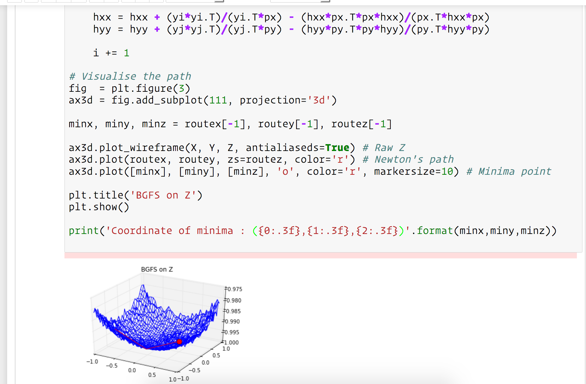

# Linear and Non-Linear Optimisations

Simple implementations of several well-known optimisation techniques. 
Just for fun.

### Linear 
- [x] Linear Least Square Fitting
- [x] Gradient Descent
- [x] Stochastic Gradient Descent

### Non-Linear
- [x] Newton's Algorithm
- [x] BGFS

---

---

# Licence

MIT